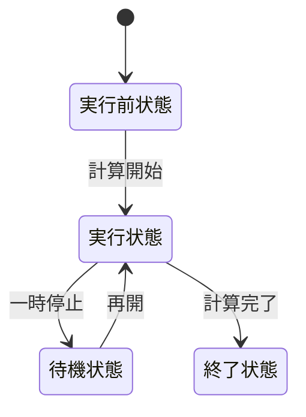
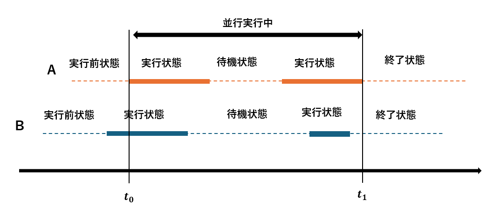
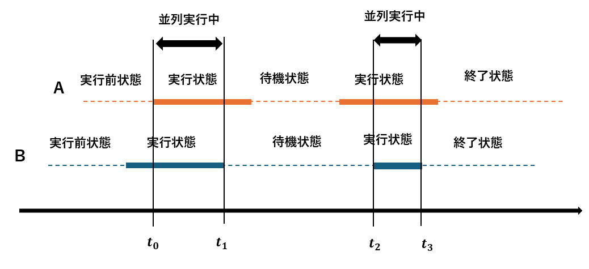
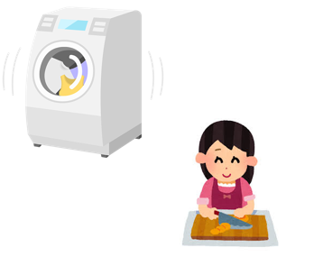

# 並行性と並列性
## プロセス
プロセス (process) とはメモリを使って何かをやっている、または待機しているプログラムひとつひとつのことである。タスクマネージャーを使えば現在稼働しているProcessの数が確認できる。1つのアプリケーションでも複数のプロセスが動いていることがわかるだろう。  
プロセスは
1. 実行前状態：計算を実行する前の状態。実行状態へ遷移可能
2. 実行状態: 計算を実行中の状態。待機状態か計算終了状態へ遷移可能
3. 待機状態: 計算を一時停止中の状態。実行状態へ遷移可能
4. 終了状態: 計算が終了した状態

プロセスは常に実行状態になっているわけではなく、実行状態から終了状態へ至る途中で待機状態になることがある。待機状態になる理由は3つある。
* データの到着を待つため: 計算対象となるデータの到着を待つ間プロセスは待機状態になる。
* 計算リソースの空きを待つ: 例えば、2人の料理人がいて包丁が1つしかない。片方が包丁を使っている間、もう片方の料理人は待機状態となる必要がある。
* 自発的に待機状態となる: タイマーだったり、何もする必要がなくなったときに待機状態になる。

## 並行性
並行性とは、2つ以上のプロセスが同時に計算を進めている状態を表す言葉である。
>定義:    
>時刻 *t* において、ある複数のプロセス $p_{0}$、$p_{0}$、$p_{1}$...$p_{n}$ が平行に実行されているということは、ある複数のプロセス $p_{0}$、$p_{0}$、$p_{1}$...$p_{n}$ が時刻 $t$ において計算途中にある、ということである  
出典: [並行プログラミング入門 (オライリー・ジャパン: 高野祐輝 著)](https://www.oreilly.co.jp/books/9784873119595/)

2人の料理人がいたときに片方の料理人は包丁を使って料理していて、もう片方はテレビを見て休憩している。このとき、どちらも料理途中であるため、並行実行中である。  
オペレーティングシステム分野では、同時に1つのプロセスしか扱えないOSのことをシングルタスクOSと呼び、並行処理可能なOSをマルチタスクOSと呼ぶ。現在、広く普及しているOSのほとんどはマルチタスクOSである。

## 並列性
並列性とは、同じ時刻で複数のプロセスが同時に計算を実行しているという状態である。
>定義:    
>時刻 *t* において、ある複数のプロセス $p_{0}$、$p_{0}$、$p_{1}$...$p_{n}$ が並列に実行されているということは、ある複数のプロセス $p_{0}$、$p_{0}$、$p_{1}$...$p_{n}$ が時刻 $t$ において実行状態である、ということである
出典: [並行プログラミング入門 (オライリー・ジャパン: 高野祐輝 著)](https://www.oreilly.co.jp/books/9784873119595/)

2人の料理人がいたときに片方の料理人が包丁を使って料理をしていて、もう片方の料理人はコンロを使って料理をしている。この場合どちらの料理人も料理している状態のため、並列実行中である。並列性は3種類に分けられる。
#### タスク並列性
複数のタスクが同時に実行されること。例えば、
* Webサーバーで1つのリクエストを処理しながら、別のリクエストも同時に処理する
* 動画編集ソフトで、映像のエンコード中に音声を処理する  

独立した複数の処理があるときに適している

#### データ並列性
同じ処理を複数のデータに対して同時に適用すること。例えば、
* 画像処理で、各ピクセルに対して同じフィルター処理を行う
* ベクトル演算で、配列の各要素に対して演算を行う  

同じ演算を大量に繰り返す場合に適している (GPUが得意)

### インストラクションレベル並列性
CPUが命令レベルで並列実行を行うこと。1つのプログラム中の命令を、依存性がない範囲で同時に実行する。例えば、
* 足し算と掛け算の命令を同時に実行
* パイプライン化やアウト・オブ・オーダー実行  

単一スレッドの処理を少しでも早くしたいときに適している

## 並行性の必要性と問題点
並行処理が重要とされる理由は、計算リソースの効率的な活用、並行性、利便性の3つである。並行処理ができると、IO待ち (コンピュータのプログラムやプロセスがディスクやネットワーク、周辺機器などの入出力処理が完了するのを待っている状態) などの待機中に他の仕事を行えるため、計算リソースを効率的に活用できる。例えば、洗濯をする際、洗濯機が終了するまで他のことを何もしない人はそういないだろう。  
並行処理の問題点は再現性が低いということである。例えば、4つのプロセスがあるとする。その計算パス (計算する順番) は 4!=24 パターンもある。n! パターンの内、数パターンにだけバグが存在した場合、極めて再現性の低い厄介なバグになってしまう。並行処理にはこのように複雑性、すなわち計算パスの爆発という問題が付きまとう。

## Exercise
#### Q1 以下のうち並列性の説明として最も適切なものはどれか
1. 複数のプロセスが順番に処理を行っていること
2. 複数のプロセスがすべて計算途中状態にあること
3. 複数のプロセスが同時に実行状態にあること
4. 複数のタスクを直列に処理すること  

答え

3

#### Q2  並行性と並列性の違いを、1つのCPUコアしか持たないコンピュータと、4つのCPUコアを持つコンピュータのケースで説明する

答え

1つのCPUコア  

並行性:  
 スケジューラによって、プロセス間でコンテキストスイッチが行われる。そのため、あるプロセスが実行状態でほかのプロセスが待機状態という状況になり並行性が実現される  
並列性:  
1つのコアしかないため、複数のプロセスは同時に実行状態になれないため、並列性は不可能 

4のCPUコア  
並行性:  
待機中と実行中のプロセスが混在する。  

並列性:  
4つのプロセスなら同時に実行状態になれる  

