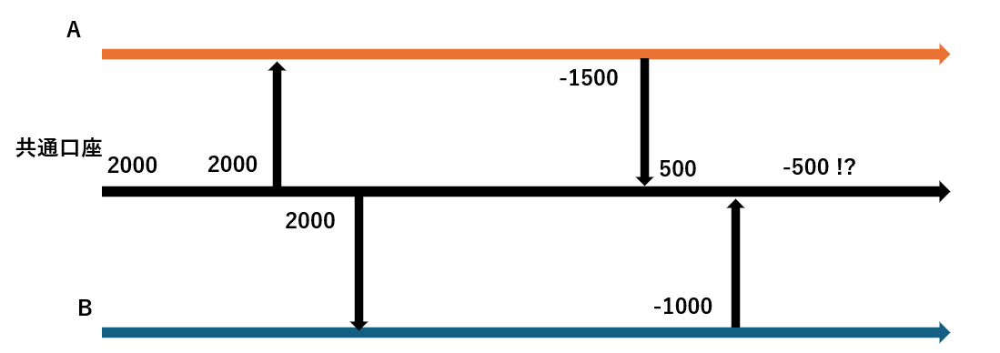
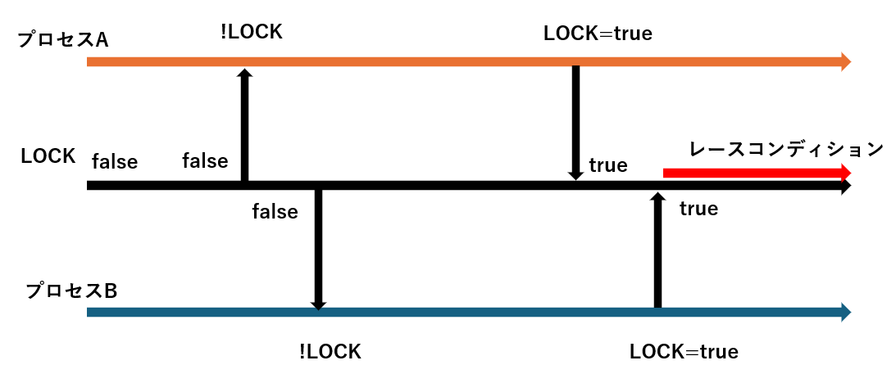
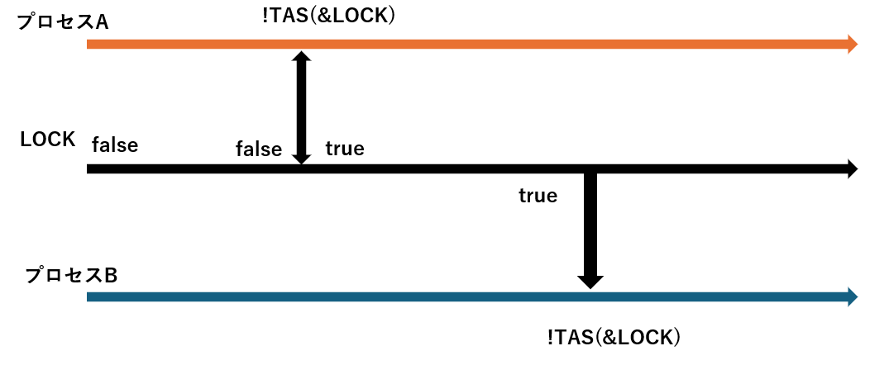
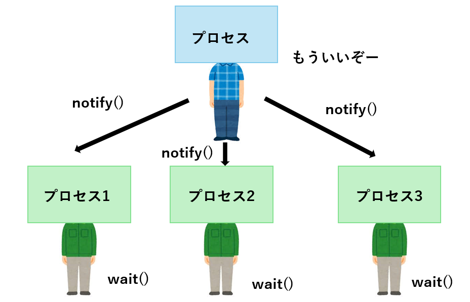

# 同期処理
**同期処理** (synchronous processing) とはある処理が終わるまで、何もしないで次の処理を待つという制御方式である。例えばATMが1つあり、ある人が使っているとする。そこに別の人がやってきてATMを使おうとするが、既にほかの人が使っていることが発覚したら、同期処理ならその場で何もしないでATMが空くのを待つ。先に述べると、この何もしない時間に他の処理をすることを非同期処理と呼ぶ。

## レースコンディション
**レースコンディション** (race condition) とは日本語で競合状態と訳され、複数のプロセスが並行して共有リソースにアクセスした結果引き起こされる、予期しない異常な状態のことを示す。例えば、同じ口座からお金を下ろす人が2人いたとする。口座には2000円入っていて、Aさんは1500円下ろした。Bさんは口座が500円に反映される前にAさんと同じタイミングで1000円を下ろした。すると共通の口座は-500円という予期しない状態になる。


レースコンディションを引き起こすプログラムコードの部分のことをクリティカルセクション (critical section) と呼ぶ。  
この例では口座からお金を引き下ろす処理と、それを口座上に反映する処理の間に他の処理を挟まないようにすることで解決できる。プログラム単位では、特にアトミックな処理を意識することが大切になる。

## アトミック処理
**アトム** (atom) とは古代ギリシアの哲学者デモクリトスが発明した用語で、この世はこれ以上分割不可能な単位であるアトムから構成されているという考えからきている。これと同じように、**アトミック処理**  (atomic operation) とは、不可分操作と呼ばれる処理であり。それ以上分割不可能な処理のことをいう。
>定義:  
>ある処理がアトミックであるということは、その処理の途中状態はシステム的に観測することが出来ず、かつ、もしその処理が失敗した場合は完全に処理前の状態に復元される  
>出典: [並行プログラミング入門 (オライリー・ジャパン: 高野祐輝 著)](https://www.oreilly.co.jp/books/9784873119595/)

### Compare and Swap
**Conpare and Swap** (CAS) はCPUが提供するアトミック操作の一つで、多くの言語やライブラリで使用されている。変数の現在の値が予想した値と同じなら、新しい値に置き換える
```c
bool compare_and_swap(uint64_t *p, uint64_t val, uint64_t newval){
    if (*p != val) {
        return false;
    }
    *p = newval;
    return true;
}
```
上に書いたコードはアトミックではない。複数のCPUコアやスレッドが同時にこの関数を読んだ場合、読み込み (`*p!=val`) と書き込み (`*p=newval`) の間に他のスレッドが値を書き換える可能性がある。これと同じ操作をアトミックに処理するための組み込み関数である`__sync_bool_compare_and_swap`という関数が用意されている。
 ```c
 bool atomic_compare_and_swap(uint64_t *p, uint64_t val, uint64_t newval) {
    return __sync_bool_compare_and_swap(p, val, newval);
}
```
 
### Test and Set
**Test and Set** (TAS) もCPUが提供するアトミック操作の1つである。変数が`true`なら`true`を、`false`なら`true`を代入して`false`を返す。
```c
bool test_and_set(bool *p){
    if(*p){
        return true;
    }else{
        *p=true;
        return false;
    }
}
```
ただ、これもアトミックではない。同じ操作をするアトミックな関数`__sync_lock_test_and_set`が用意されている。
```c
type __sync_lock_test_and_set(type *p,type val){
    type tmp=*p;
    *p=val;
    return tmp;
}
```

## ミューテックス
**ミューテックス** (mutex) とはMUTual EXecutionの略であり、日本語だと排他実行と呼ばれる同期処理の方法である。排他的に実行を行うため、共有変数となるロックを用意しておいて、そのロックを獲得して`lock=true`ならクリティカルセクションを実行し、そうでなければクリティカルセクションを実行しない。例えば、ある家にはトイレが1つしかないとする。誰かが使うときは鍵をかけて使用中にする。他の人は誰かが使用中のとき、トイレの前で鍵が開くのを何もしないで待っている。
```rust
static mut LOCK: bool =false;

fn some_func(){
    unsafe{
        while LOCK{
        }

        LOCK=true;

        //クリティカルセクション

        LOCK=false;
    }
}
```
他の誰かがロックをしている間 (`LOCK=true`) は`while`を回して何もしないで待っている。ロックが外れたら (`LOCK=false`) のときロックを獲得してクリティカルセクションを実行する。`some_func`を2つのプロセスA、Bで実行したとする。プロセスAがロックが外れたことを把握した直後にプロセスBもロックが外れたことを把握したとき、どちらのプロセスもロックを獲得し、クリティカルセクションを実行する。これはレースコンディションの原因となる。  



このような2つ以上のプロセスが同じロックを獲得できてしまうのは、ロックの読み込みと、ロックの書き込みがアトミックに行われていないからである。アトミックな処理であるTAS関数を利用すれば、ロックの読み込みとロックの書き込みの間に他のプロセスがロックを読み込むことがなくなる。



Rustでは標準ライブラリとしてミューテックスが提供されている。ミューテックスでロックを獲得している最中は他のプロセスがロックを獲得する心配をする必要はない。

```rust
use std::sync::{Arc, Mutex}; 
use std::thread;

fn some_func(lock: Arc<Mutex<u64>>) { //スレッド用関数
    loop {
        // ロックしないとMutex型の中の値は参照不可
        let mut val = lock.lock().unwrap(); // lock関数でロックを獲得
        *val += 1;
        println!("{}", *val);
    }
}

fn main() {
    // Arcはスレッドセーフな参照カウンタ型のスマートポインタ
    let lock0 = Arc::new(Mutex::new(0)); //ミューテックス用変数を所持する

    // 参照カウンタがインクリメントされるのみで
    // 中身はクローンされない
    let lock1 = lock0.clone(); //クローンする。参照カウンタがインクリメントされる

    // スレッド生成
    // クロージャ内変数へmove
    let th0 = thread::spawn(move || { //所有権移動
        some_func(lock0);
    });

    // スレッド生成
    // クロージャ内変数へmove
    let th1 = thread::spawn(move || {
        some_func(lock1);
    });

    // 待ち合わせ
    th0.join().unwrap();
    th1.join().unwrap();
}
```
Rustでは所有権、借用規則によりコンパイル時に共有リソースへの不正なアクセスを防ぐことが出来るように設計されている。さらに、保護対象データがスコープを外れたときに自動的にロックを解放する。`lock`関数は`LockResult<MutexGurad<'_,T>>`という型を返す。
```rust
type LockResult<Guard>=Result<Guuard,PoisonError<Guard>>;
```
ロックを獲得できた場合は`MutexGuard`という型に保護対象データを包んでリターンする。`try_lock`関数はロックの獲得を試みて獲得できればロックするが、そうでない場合即座に関数から処理が戻るという動作をする。

### Exercise
#### Q1
2つのスレッドでカウンターをインクリメントしていき、合計が100になったらスレッドを終了する
* 各スレッドのループで値を更新するが、1回の更新ごとに1~5のランダムな数値を足す
* 値が100以上になったら、それ以上インクリメントしないでループを抜けて終了する
* 値を更新するたびにカウントを表示する (`threadA: 48`)
* クリティカルセクションをして、ロックを解放するタイミングでスレッドを100ms sleepさせる (`thread::sleep(Duration::from_millis(100))`)

出力例
```
threadA: 3
threadB: 7
threadA: 12
threadB: 17
threadA: 19
...

threadB: 100
threadA: 100
```

<details>

```rust
use std::sync::{Arc,Mutex};
use std::thread;
use rand::Rng;
use std::time::Duration;

fn add_random(id:&str,lock:Arc<Mutex<u64>>){
    loop{
        let mut v=lock.lock().unwrap();
        let num=rand::thread_rng().gen_range(1..6);

        if *v+num>=100{
            println!("thread{}: {}",id,100);
            break;
        }
        *v+=num;

        println!("thread{}: {}",id,v);
        drop(v);
        thread::sleep(Duration::from_millis(100));
    }
}

fn main(){
    let lock=Arc::new(Mutex::new(0));
    let lock0=lock.clone();
    let lock1=lock.clone();

    let th0=thread::spawn(move||{
       add_random("A",lock0); 
    });

    let th1=thread::spawn(move||{
        add_random("B",lock1);
    });

    th0.join();
    th1.join();

}
```
</details>

### Q2 
以下の要件を満たすRustプログラムを作成する
1. 5つのスレッドを生成する
2. 各スレッドは共通のログバッファ (`Vec<String>`) にメッセージを追加する
3. スレッドは`try_lock`を使ってロックを試みる
    - 成功したら`"Thread {i} wrote to log"`をログバッファに追加する
    - 失敗したら`"Thread {i} could not acquire lock"`を標準出力する
4. 最後に、すべてのスレッドが終了した後にログバッファの中身を表示する
5. ロックの獲得したら100ms sleepする  

出力例
```
Thread 1 could not acquire lock
Thread 4 could not acquire lock
Thread 3 could not acquire lock
Thread 2 could not acquire lock
Thread 0 wrote to log
```

<details>

```rust
use std::sync::{Arc,Mutex};
use std::thread;
use std::time::Duration;
fn add_to_log_buffer(id:usize,log_buffer:Arc<Mutex<Vec::<String>>>){
    thread::sleep(Duration::from_millis(10*(id as u64 %3)));
    match log_buffer.try_lock(){
        Ok(mut buffer)=>{
            thread::sleep(Duration::from_millis(100));
            buffer.push(format!("Thread {} wrote to log",id));
        }
        Err(_)=>println!("Thread {} could not acquire lock",id),
    }
}
    

fn main(){
    let log_buffer=Arc::new(Mutex::new(Vec::<String>::new()));
    let mut handles=Vec::new();
    for i in 0..5{
        let log_buffer_i=log_buffer.clone();
        let handle=thread::spawn(move||{
           add_to_log_buffer(i,log_buffer_i); 
        });

        handles.push(handle);
    }

    for handle in handles{
        handle.join().unwrap();
    }

    let buffer=log_buffer.lock().unwrap();
    for v in buffer.iter(){
        println!("{}",v);
    }
}
```
</details>

## 条件変数
ある条件が満たされない間はプロセスを待機しておき、条件が満たされた場合に待機中のプロセスに通知して実行したい場合がある。例えば、私たちはレストランが満席のとき名前を書いて順番を待つ。そして、積が空いて順番が回ってきたら、店員から「お待たせしました」と呼ばれる。このように私たち (スレッド) は条件 (席が空く) が満たされたことが通知されるまで待機する

```rust
use std::sync::{Arc, Mutex, Condvar}; 
use std::thread;

// Condvar型の変数が条件変数であり、
// MutexとCondvarを含むタプルがArcに包んで渡される
fn child(id: u64, p: Arc<(Mutex<bool>, Condvar)>) { //Condvarが条件変数用の型
    let &(ref lock, ref cvar) = &*p;

    // まず、ミューテックスロックを行う
    let mut started = lock.lock().unwrap(); //ロックを試す
    while !*started { // Mutex中の共有変数がfalseの間ループ
        // waitで待機
        started = cvar.wait(started).unwrap(); //通知があるまで待機

    }

    // 以下のようにwait_whileを使うことも可能
    // cvar.wait_while(started, |started| !*started).unwrap();

    println!("child {}", id);
}

fn parent(p: Arc<(Mutex<bool>, Condvar)>) { //通知用スレッド
    let &(ref lock, ref cvar) = &*p;

    // まず、ミューテックスロックを行う
    let mut started = lock.lock().unwrap();
    *started = true;   // 共有変数を更新
    cvar.notify_all(); // 通知
    println!("parent");
}

fn main() {
    // ミューテックスと条件変数を作成
    let pair0 = Arc::new((Mutex::new(false), Condvar::new()));
    let pair1 = pair0.clone();
    let pair2 = pair0.clone();

    let c0 = thread::spawn(move || { child(0, pair0) });
    let c1 = thread::spawn(move || { child(1, pair1) });
    let p  = thread::spawn(move || { parent(pair2) });

    c0.join().unwrap();
    c1.join().unwrap();
    p.join().unwrap();
}
```
親が共有変数`started`を`true`にすることで条件が満たされ`children`スレッドに通知される。
```
parent
child 0
child 1
```

### Exercise
ある共有バッファを使って、producerがデータを追加し、consumerがデータを取り出して処理するという1対1のスレッド同期を実装する。
* 共有バッファは容量5つまで
* consumerはデータが空なら待機する。あるなら取り出す。
* 各スレッドはループで合計10回データを処理したら終了する  
* スレッドproducerとconsumerの2つ  

出力例
```
producer: 0
producer: 1
producer: 2
producer: 3
producer: 4
producer: 5
consumer: 0
consumer: 1
consumer: 2
consumer: 3
consumer: 4
consumer: 5
producer: 6
consumer: 6
producer: 7
producer: 8
producer: 9
consumer: 7
consumer: 8
consumer: 9
```

<details>

```rust
use std::sync::{Arc,Mutex,Condvar};
use std::thread;
use std::collections::VecDeque;
use std::time::Duration;

fn produce(p:Arc<(Mutex<VecDeque<u32>>,Condvar,Condvar)>){
    let mut cnt=0;
    loop{
        let &(ref lock,ref is_full,ref is_empty  )=&*p;
        let mut buffer=lock.lock().unwrap();

        if cnt>=10{
            break;
        }
        //満杯だったらwaitする
        while buffer.len()>5{
            buffer=is_full.wait(buffer).unwrap();
        }
        buffer.push_back(cnt);
        is_empty.notify_all();
        println!("producer: {}",cnt);
        cnt+=1;
        thread::sleep(Duration::from_millis(100));

    }
}

fn consume(p:Arc<(Mutex<VecDeque<u32>>,Condvar,Condvar)>){
    let mut cnt=0;
    loop{
        let &(ref lock,ref is_full,ref is_empty  )=&*p;
        let mut buffer=lock.lock().unwrap();

        if cnt>=10{
            break;
        }
        if buffer.len()==0{
            buffer=is_empty.wait(buffer).unwrap();
        }

        let fr=match buffer.front(){
            Some(f)=>f,
            None=>panic!("the queue os empty"),
        };
        println!("consumer: {}",fr);
        buffer.pop_front();
        if buffer.len()<5{
            is_full.notify_all();
        }
        cnt+=1;
        thread::sleep(Duration::from_millis(100));
    }
}

fn main(){
    let buffer
    =Arc::new((Mutex::new(VecDeque::<u32>::new()),
    Condvar::new(),Condvar::new()));
    
    let lock_p=buffer.clone();
    let lock_c=buffer.clone();

    let producer=thread::spawn(move||{
        produce(lock_p);
    });

    let consumer=thread::spawn(move||{
        consume(lock_c)
    });

    producer.join().unwrap();
    consumer.join().unwrap();
}
```
バッファが空になったときはconsumerは待機状態になる。バッファに値が入れられたときはproducerからconsumerにis_emptyで通知を送る。バッファが5以上のサイズになったときはproducerは待機状態になる。consumerが消費してバッファのサイズが5未満になったときconsumerはproducerにis_fullで通知する。
</details>

